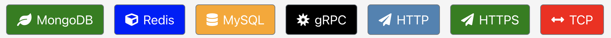

<h1 align="center" style="border-bottom: none;">AllProxy: HTTP MITM Debugging Proxy</h1>

MITM debugging proxy with a web GUI to view and modify all of the HTTP and HTTPS (SSL) traffic between your machine and the Internet.  Also supports reverse proxy protocols: HTTP, HTTPS, MongoDB, Redis, MySQL and gRPC.

### Install

> Mac: **[allproxy.dmg](https://github.com/allproxy/allproxy/releases/download/v3.32.0/allproxy-3.32.5-x64.dmg)**

> RedHat: **[allproxy.rpm](https://github.com/allproxy/allproxy/releases/download/v3.32.0/allproxy-3.32.5-1.x86_64.rpm)**

> Ubuntu: **[allproxy.deb](https://github.com/allproxy/allproxy/releases/download/v3.32.0/allproxy_3.32.5_amd64.deb)**

> Windows: **[Setup.exe](https://github.com/allproxy/allproxy/releases/download/v3.32.0/allproxy-3.32.5.Setup.exe)**

> Other install options:
> 1. Install NPM package: `npm install -g allproxy`
>    * Run: `allproxy` or `allproxy_win.bat`
>    * [localhost:8888/allproxy](http://localhost:8888/allproxy) in browser
> 2. Clone repo and run: **npm install && npm run build && npm start**
> 3. Clone repo and run headless: **npm install && npm run build && npm run headless**
>    * http://localhost:8888/allproxy in browser
> 3. Docker container:
>    * docker build -t allproxy .
>    * docker run --name allproxy -i -t -v ~/.allproxy:/root/.allproxy —expose 8888 -p 9999:8888  allproxy
>    * http://localhost:8888/allproxy in browser

Supported reverse proxy protocols:

## License

This code is licensed under the [MIT License](https://opensource.org/licenses/MIT).

  
