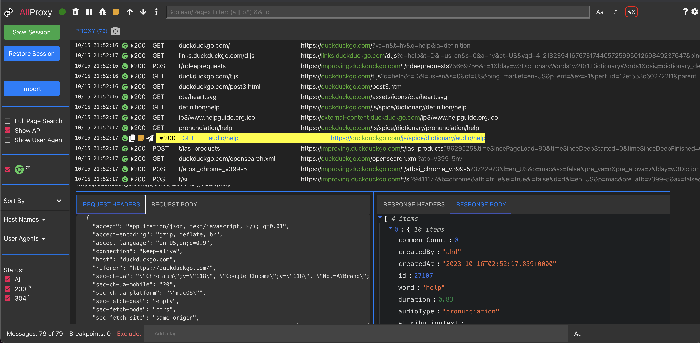
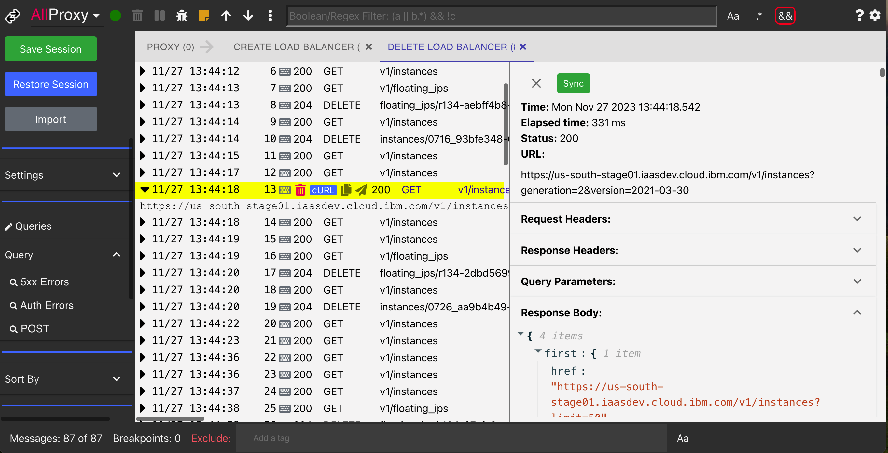
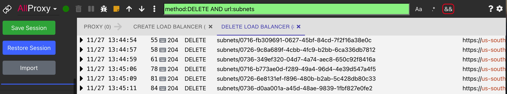
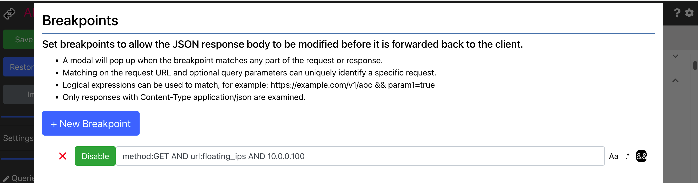
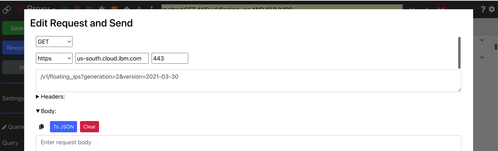
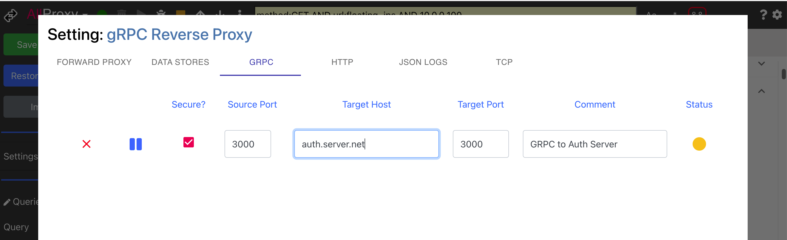
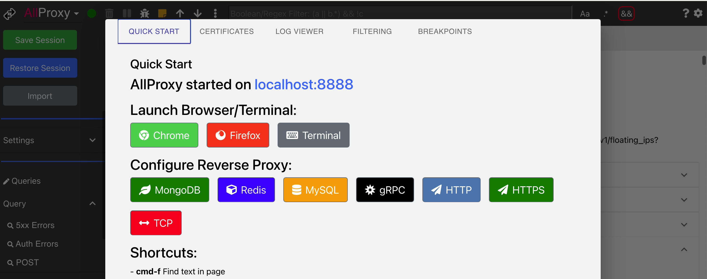

<h1 align="center" style="border-bottom: none;">AllProxy: HTTP MITM Debugging Proxy</h1>

MITM debugging proxy with a web GUI to view and modify all of the HTTP and HTTPS (SSL) traffic between your machine and the Internet.  Also supports reverse proxy protocols: HTTP, HTTPS, MongoDB, Redis, MySQL and gRPC.

Also imports JSON logs to make them human readable.

### Try AllProxy Online

To try a `readonly` demo:
* Click [Try AllProxy](https://allproxy.ddns.net/allproxy)
* On the left side panel click the `Restore Session` button
* From the Restore Session Modal click `Restore` to restore a sample session

### Install

> Options:
> 1. Install NPM package: `npm install -g allproxy`
>    * Run: `allproxy` or `allproxy_win.bat`
> 2. Clone repo and run: **npm install && npm run build && npm start**
> 3. Docker container:
>    * docker build -t allproxy .
>    * docker run --name allproxy -i -t -v ~/.allproxy:/root/.allproxy —expose 8888 -p 9999:8888  allproxy

> Open `allproxy` in browser;
>    * [localhost:8888/allproxy](http://localhost:8888/allproxy)

**NOTE**:
It is recommended that `Use hardware acceleration when available` is disabled on Chrome.

### Electron Application

See the [Releases](https://github.com/allproxy/allproxy/releases) to download an Electron Applications for MacOS, Linux and Windows.

### JSON Log Viewer

JSON structured logs can be viewed in a human readable format.  See [jlogviewer](https://github.com/allproxy/jlogviewer) for more details.

### HTTPS Proxy
AllProxy is a man-in-the-middle server that captures the traffic between your application and web server.   You can inspect the complete HTTP request and response.

### Advanced Filtering
Use advanced filter criteria to find what you're looking for.   Use complex boolean expressions to match the protocol, payload, URL, headers, and just about any part of the request or response message.

### Breakpoints
Set breakpoints to stop the HTTP request and optionally modify it before sending it to the web server.

### Modify and Resend Requests
Modify and resend any captured HTTP requests.

### Reverse Proxy
Resource proxy protocols include: MongoDb, Redis, MySQL, qGRPC, HTTP, HTTPS and TCP.

### Integrated Online Help
AllProxy has a Help modal to help you configure and use the application.

## License

This code is licensed under the [MIT License](https://opensource.org/licenses/MIT).

  
